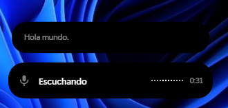
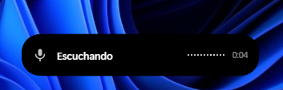
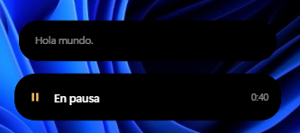

# Riff

**Dictado por voz global para Windows.** Pulsa `Alt+R` en cualquier aplicación, habla, pulsa
`Enter` y el texto aparece donde tenías el cursor. En español y con puntuación de verdad:
comas, puntos, puntos suspensivos y los signos de apertura `¿` y `¡`.

Gratis y sin límites prácticos: usa el plan gratuito de Groq, que da **8 horas de dictado al
día sin coste y sin tarjeta**.

<p align="center">
  
</p>

Mientras hablas, el texto va apareciendo en una segunda burbuja que **emerge de la isla como
una gota de líquido** y crece con lo que dices. Tu documento no se toca hasta que pulsas
`Enter`.

<p align="center">
  
  <br>
  <em>Escuchando: las barras siguen tu voz en tiempo real.</em>
</p>

<p align="center">
  
  <br>
  <em>En pausa: el micrófono se detiene de verdad y el texto se conserva. Pulsa
  <code>Alt+R</code> para seguir donde lo dejaste.</em>
</p>

---

## Instalación

1. Descarga el instalador desde [Releases](../../releases/latest)
2. Ejecútalo. **Windows mostrará un aviso de SmartScreen** porque la aplicación no está
   firmada digitalmente: pulsa **Más información → Ejecutar de todas formas**. Firmar un
   ejecutable cuesta varios cientos de euros al año, algo fuera del alcance de un proyecto
   gratuito. El código está entero en este repositorio, y puedes compilarlo tú mismo.
3. Al abrirse te pedirá una API key de Groq. Créala gratis en
   [console.groq.com/keys](https://console.groq.com/keys) — no piden tarjeta.

Riff vive en la bandeja del sistema, junto al reloj.

## Uso

| Tecla | Acción |
|---|---|
| **Alt+R** | Empezar a dictar · **pausar** · reanudar (las veces que quieras) |
| **Enter** | Insertar el texto donde esté el cursor |
| **Esc** | Descartar el dictado |

Mientras hablas, el texto va apareciendo en la isla para que veas que te está entendiendo,
pero **tu documento no se toca hasta que pulsas `Enter`**.

> Mientras Riff está grabando o en pausa, `Enter` y `Esc` quedan reservados para él y no
> llegan al resto de aplicaciones. Se liberan en cuanto insertas o cancelas.

El atajo principal se cambia desde el menú de la bandeja (`Alt+R`, `Alt+J`, `Alt+Q`,
`Ctrl+Space`). Ten en cuenta que el atajo elegido queda reservado en todo el sistema.

## Cómo funciona

Riff usa una arquitectura de **dos etapas**, la misma idea que hay detrás de Wispr Flow,
porque un solo modelo no basta:

1. **Whisper `large-v3`** transcribe el audio. Acierta las palabras, pero es irregular con la
   puntuación española.
2. **Un LLM** repasa el texto: coloca la puntuación, abre preguntas y exclamaciones, corrige
   tildes y elimina muletillas.

Esa segunda pasada es lo que hace que el resultado parezca escrito y no dictado. Si falla o
tarda, se usa la transcripción en bruto: **nunca se pierde un dictado**.

### Decisiones que marcan la diferencia

- **La isla nunca roba el foco.** La ventana lleva `WS_EX_NOACTIVATE`, así que tu cursor de
  texto se queda donde estaba y el pegado aterriza en el sitio correcto. Sin esto no habría
  producto.
- **El audio se corta en tus pausas al respirar**, no cada N segundos. Así cada fragmento es
  una frase completa y el modelo puede puntuarla bien, porque la oyó entera.
- **El teclado no se transcribe.** Se exige energía sostenida durante 90 ms para aceptar que
  algo es voz: una tecla suena 10-30 ms, una sílaba mucho más. Sin este filtro, Whisper
  recibe ruido y se inventa texto.
- **El micrófono se abre desde Rust** con `cpal`, no con `getUserMedia`, lo que evita el
  diálogo de permisos de WebView2.
- **El portapapeles se restaura** después de pegar, para no pisar lo que tuvieras copiado.
- **Nada se anima en reposo**, para no molestar en equipos modestos. Riff ocupa unos 30 MB
  de RAM y 0 % de CPU mientras espera.

## Compilar desde el código

Necesitas [Rust](https://rustup.rs) y los **Build Tools de C++ de Visual Studio**
(carga "Desarrollo de escritorio con C++").

```bash
npm install -g "@tauri-apps/cli@^2"
tauri build          # instalador en src-tauri/target/release/bundle
tauri dev            # desarrollo
```

> En Windows, compila desde **PowerShell**, no desde Git Bash: Git Bash trae en su `PATH` una
> utilidad `link.exe` de GNU que secuestra al enlazador de Microsoft y produce errores
> desconcertantes.
>
> Si el proyecto está dentro de OneDrive, los artefactos de compilación deben quedar fuera
> (ver `src-tauri/.cargo/config.toml`): la sincronización le arrebata los archivos al
> compilador y la build falla.

### Estructura

```
src-tauri/src/
├── main.rs     ciclo de vida, bandeja, atajos y máquina de estados
├── audio.rs    cpal, segmentación por pausas, detección de voz, WAV
├── groq.rs     transcribe() y polish()
├── paste.rs    portapapeles y Ctrl+V sintético
├── win.rs      WS_EX_NOACTIVATE
└── config.rs   configuración en disco
src/            la isla: HTML, CSS y JS sin framework ni bundler
```

La configuración se guarda en `%APPDATA%/com.baruk.riff/config.json`.

## Limitaciones

- **Necesita conexión a internet.** Un respaldo local con whisper.cpp queda pendiente.
- **No llega a ventanas elevadas.** Si dictas en una aplicación que corre como
  administrador y Riff no, el texto se queda en el portapapeles para que lo pegues a mano.
- **Solo Windows**, por ahora.

## Licencia

MIT — ver [LICENSE](LICENSE).
